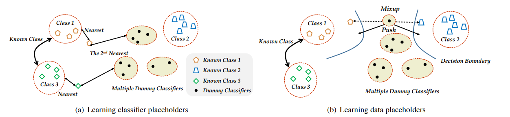

# Learning Placeholders for Open-Set Recognition  (Proser)

The code repository for "Learning Placeholders for Open-Set Recognition
" [[paper]](https://openaccess.thecvf.com/content/CVPR2021/papers/Zhou_Learning_Placeholders_for_Open-Set_Recognition_CVPR_2021_paper.pdf) (CVPR21) in PyTorch. If you use any content of this repo for your work, please cite the following bib entry:

    @inproceedings{zhou2021learning,
    author = {Zhou, Da-Wei and Ye, Han-Jia and Zhan, De-Chuan},
    title = {Learning Placeholders for Open-Set Recognition.},
    booktitle = {CVPR},
    pages = {4401-4410},
    year = {2021}
    }

## Learning Placeholders for Open-Set Recognition


Traditional classifiers are deployed under closed-set setting, with both training and test classes belong to the same set. However, real-world applications probably face the input of unknown categories, and the model will recognize them as known ones. Under such circumstances, open-set recognition is proposed to maintain classification performance on known classes and reject unknowns. The closed-set models make overconfident predictions over familiar known class instances, so that calibration and thresholding across categories become essential issues when extending to an open-set environment. To this end, we proposed to learn PlaceholdeRs for Open-SEt Recognition (Proser), which prepares for the unknown classes by allocating placeholders for both data and classifier. In detail, learning data placeholders tries to anticipate open-set class data, thus transforms closed-set training into open-set training. Besides, to learn the invariant information between target and non-target classes, we reserve classifier placeholders as the class-specific boundary between known and unknown. The proposed Proser efficiently generates novel class by manifold mixup, and adaptively sets the value of reserved open-set classifier during training. Experiments on various datasets validate the effectiveness of our proposed method.



## Prerequisites

The following packages are required to run the scripts:

- [PyTorch-1.4 and torchvision](https://pytorch.org)

- Dataset: please download the dataset and unzip it into the folder data/cifar 

- Pre-trained weights: we provide [our pretrained weights](https://drive.google.com/file/d/1Pwnetsy59fXRTgeYhUp5S0k-EqDuQ-CF/view?usp=sharing) for this trial. Download and put it to 'results/Dcifar10_relabel-Msoftmax-BWideResnet/LR0.1-K[8 4 7 2 1 9]-U[3 0 6 5]-Seed9/'  You can also use the pretrain code for other tasks. See below for details.

## Dataset

### CIFAR10
Download  [CIFAR10 matlab version](https://www.cs.toronto.edu/~kriz/cifar.html) and unzip it to data/cifar/

## Code Structures
There are four parts in the code.
 - `models`: It contains the backbone network for the experiment
 - `data`: Images and splits for the data sets, as well as the data preprocessing code.
 - `results`: The pre-trained weights of different networks.
 
## Unknown Detection
We provide the code to reproduce results on CIFAR 10 unknown detection task, c.f. Table.1 in the main paper.

- Download the pretrained weights:

- Train the Proser model 

  ```
  python proser_unknown_detection.py
  ```
  
  and you will get corresponding AUC measures.

  

 
## Acknowledgment
We thank the following repos providing helpful components/functions in our work.
- [pytorch-cifar](https://github.com/kuangliu/pytorch-cifar)

- [FEAT](https://github.com/Sha-Lab/FEAT)


## Contact 
If there are any questions, please feel free to contact with the author:  Da-Wei Zhou (zhoudw@lamda.nju.edu.cn). Enjoy the code.# Proser
